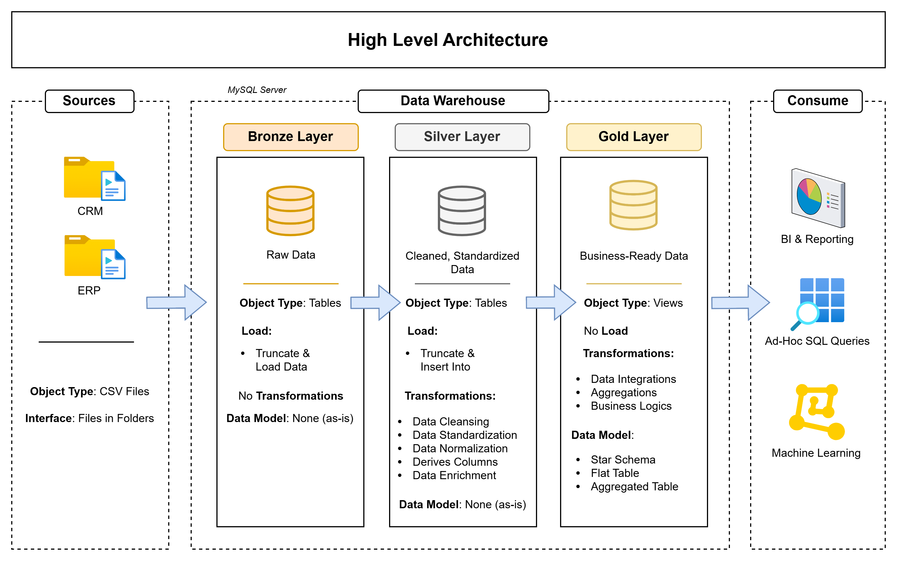

# 🏗️ Data Warehouse Project  
_Welcome to my first Data Warehouse project. This portfolio project is inspired by
👉 [DataWithBaraa – SQL Data Warehouse Project](https://github.com/DataWithBaraa/sql-data-warehouse-project)._


---

## 🎯 Project Overview  
This project demonstrates the design and implementation of a complete **Data Warehouse** using **MySQL**.  
It showcases practical skills in:
1. **Data architecture**: Designing a modern Data Warehouse with a Medallion Architecture.
2. **ETL processes**: Extracting, transforming and loading data from a source system.
3. **Data modeling**: Creating fact and dimension tables for analytical queries.


---

## 🏗️ Architecture & Approach  
The architecture follows the **Bronze – Silver – Gold** (Medallion) model:



1. **Bronze Layer** – Raw data (CSV exports from ERP/CRM) loaded directly into MySQL  
2. **Silver Layer** – Data cleaning, standardization, and normalization  
3. **Gold Layer** – Business-ready data (star schema) for reporting and insights

---

## 📋 Repository Structure  
```text
/ datasets/           -> Raw data files (CSV)  
/ docs/               -> Documentation  
/ scripts/            -> MySQL scripts  
   / bronze/          -> Scripts for extracting and loading raw data  
   / silver/          -> Scripts for cleaning and transforming data  
   / gold/            -> Scripts for creating analytical models  
/ tests/              -> Scripts for data quality checks  
README.md             -> This file  
LICENSE               -> License information for the repository
```
---

## 🌟 About Me
Hello everyone. My name is **Alexander Konetschny**. 
After completing my master's degree in materials science, I worked in research and development for self-regulating heating cables for almost four years, followed by a short stint in project management at a machine manufacturer for the pharmaceutical industry.

Throughout this time, I have never lost my fascination with creating value from raw data, preferably in an automated way.
That's why I completed further training in data science to pursue my passion for developing smart insights and applicable solutions from complex data.

_Hold the vision, trust the process_

[](https://www.linkedin.com/in/alexander-konetschny-401501191/)


